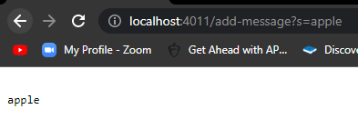
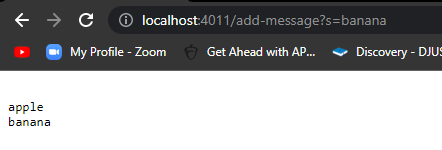
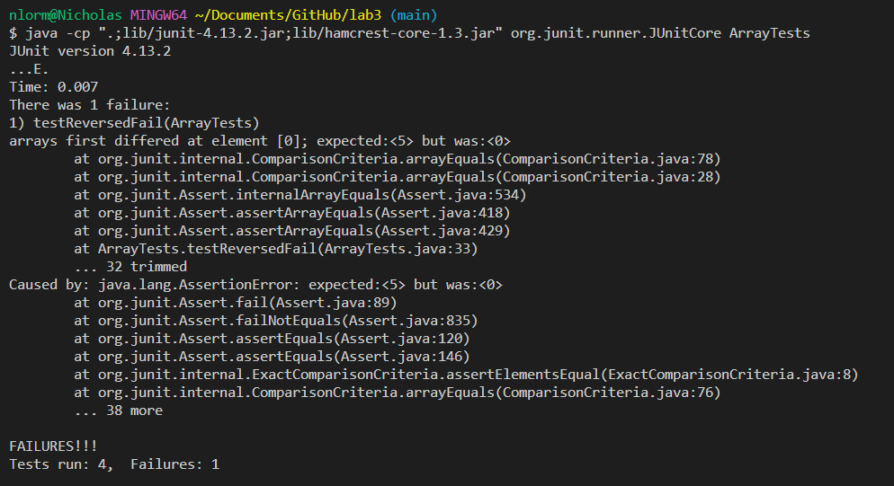

## Part 1

Code for `StringServer`:  
```
import java.io.IOException;
import java.net.URI;

class Handler implements URLHandler {
    String str = "";

    public String handleRequest(URI url) {
        if (url.getPath().equals("/")) {
            return str;
        } 
        else {
            System.out.println("Path: " + url.getPath());
            if (url.getPath().contains("/add-message")){
                String[] parameters = url.getQuery().split("=");
                if (parameters[0].equals("s")) {
                    str += "\n" + parameters[1];
                    return str;
                }
            }
            return "404 Not Found";
        }
    }
}

class SearchEngine {
    public static void main(String[] args) throws IOException {
        if(args.length == 0){
            System.out.println("Missing port number! Try any number between 1024 to 49151");
            return;
        }

        int port = Integer.parseInt(args[0]);

        Server.start(port, new Handler());
    }
}
```

Examples of using `/add-message`:  
  
* The one method called was `handleRequest` which determines the course of action depending on the URI.
* The relevant argument of `url` of method `handleRequest` is what is typed in the search bar, determining what is displayed on the page. For this example `url` is set to `http://localhost:4011/add-message?s=apple`. The field `str` in class `Handler` is what is displayed on the page and is first set to an empty string `""`.
* From this specific request the `str` field changes to a string `"\napple"` due to the `handleRequest` method adding a `"\n"` and the string found after the `"="` in `url` which in this case is `"apple"`.  
  
* The method called in the screenshot was `handleRequest` which determines the course of action depending on the URI.
* The relevant argument `url` from method `handleRequest` is what is typed in the search bar, determining what is deplayed on the page. For this example `url` is set to `http://localhost:4011/add-message?s=banana`. The field `str` in class `Handler` is what is displayed on the page and is set as `"\n apple"` before the method call.
* From this specific request, the `str` field changes to a string `"\napple\nbanana"` due to the `handleRequest` method adding a `"\n"` and the string found after the `"+"` in `url` which in this case is `"banana"`.  
  
## Part 2  
The method `reversed` in class `ArrayExamples` has a bug which can be found through testing as a JUnit test  
* An example of a failure-inducing input would be an array containing 1, 2, 3, 4, 5, that being `{1, 2, 3, 4, 5}`:  
```
@Test
  public void testReversedFail() {
    int[] input1 = {1, 2, 3, 4, 5};
    assertArrayEquals(new int[]{5, 4, 3, 2, 1}, 
    ArrayExamples.reversed(input1));
  }
```
* An example of an input that doesn't induce a failure would be an empty array, that being `{}`:  
```
@Test
  public void testReversedPass() {
    int[] input1 = { };
    assertArrayEquals(new int[]{ }, ArrayExamples.reversed(input1));
  }
```
* The first test gave a symptom, and the second test passed:  
  
* The bug in method `reversed`, as depicted with a before and after the bug fix:  
```
static int[] reversed(int[] arr) {
    int[] newArray = new int[arr.length];
    for(int i = 0; i < arr.length; i += 1) {
      arr[i] = newArray[arr.length - i - 1];
    }
    return arr;
  }
```
```
static int[] reversed(int[] arr) {
    int[] newArray = new int[arr.length];
    for(int i = 0; i < arr.length; i += 1) {
      newArray[i] = arr[arr.length - i - 1];
    }
    return newArray;
  }
```  
The issue with the program was that it created a new array
with the length of the original array and copied all elements
of the new array into the original array backwards.
Since the new array had nothing put into it, this caused
the first array to be changed to all null.
By switching what array goes in which, the new array is now
set with each element being from the old array backwards, 
causing the new array to now be the backwards one,
forcing the return to be of the new array as well.  
  
## Part 3
I learned that because an input can cause multiple bugs,
its hard to know if any changes you make to your program
actually affect it in a positive manner.
This is because even if you fix a bug, if an input causes
multiple bugs, you will still see an error when you
run your program, even after you fixed a bug. That is why
you want to make you want to make tests as specific as possible
to make it easier to check if you're helping your program or not.
